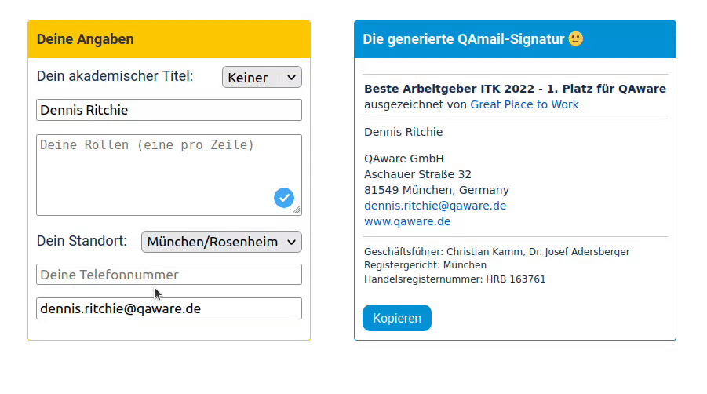

# QAmail-Signatur-Tool
The QAmail-Signatur-Tool is an Atlassian Forge App which can be integrated in Confluence. It automatically generates QAware Email signatures using stored Confluence profile data and manually added information.

To use it in your Confluence:
1. Install the QAmail-Signatur-Tool app via https://developer.atlassian.com/console/install/45eb37c6-1f09-471d-a5b1-a2819aa2017c/?signature=764b15f9ad16e7db80844a8cbb8c7bfe74f54c7a0f223fa50ce874f3856c86d6&product=confluence
2. Call the app on a Confluence page: In the editor view of your Confluence page start typing "/qamail-signatur-tool" and select the app from the list.
      
      

